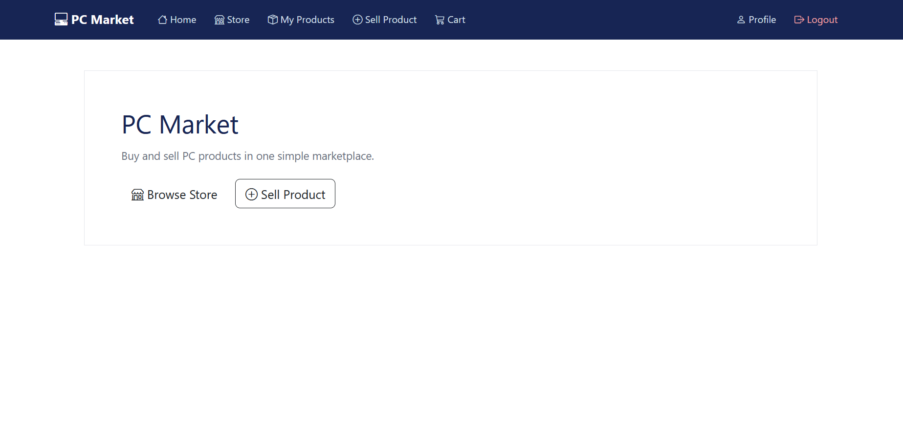
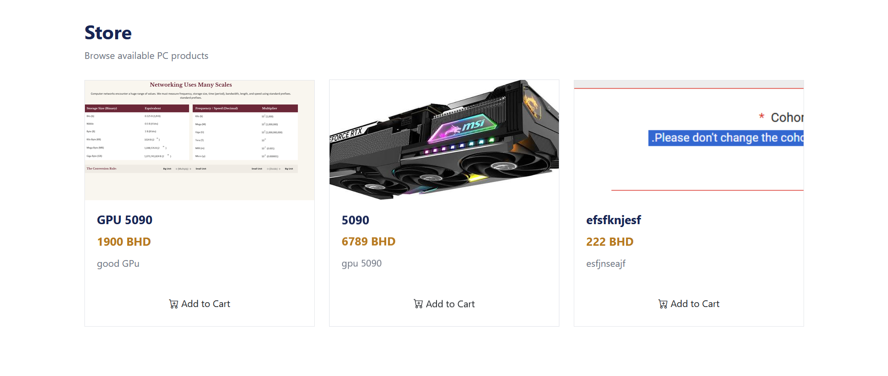
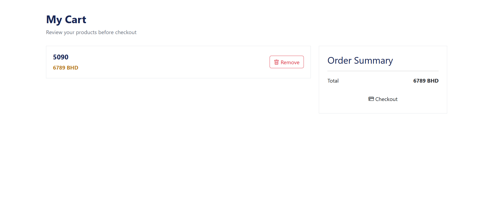

# Project Name
PC-Parts Store
## Technologies Used
NDOE.js + mongoDB + Express + multer + BOOTSTRAP ICONS + PDFKIT
## Description
One website for any product Pc 
## User Stories
Users can add and edit and update for product and can purchase and sale the product 
## Screenshots

## Future Enhancements
PDF 
ICONS Bootstrap 
## Database Design

### User

| Field | Type | Description |
|-------|------|-------------|
| username | String | User's username |
| password | String | User's hashed password |

### Product

| Field | Type | Description |
|-------|------|-------------|
| productName | String | Name of the product |
| productPrice | Number | Price of the product |
| productRiview | String | Product description |
| image | String | Product image path |
| owner | ObjectId | Reference to the user who created the product |

### Cart

| Field | Type | Description |
|-------|------|-------------|
| owner | ObjectId | Reference to the user who owns the cart |
| items | Array | Products added to the cart |
| items.product | ObjectId | Reference to a product |
| items.quantity | Number | Quantity of the product |

### Address

| Field | Type | Description |
|-------|------|-------------|
| owner | ObjectId | Reference to the user |
| country | String | User's country |
| city | String | User's city or area |
| block | String | Block number |
| road | String | Road number |
| building | String | Building or house number |

